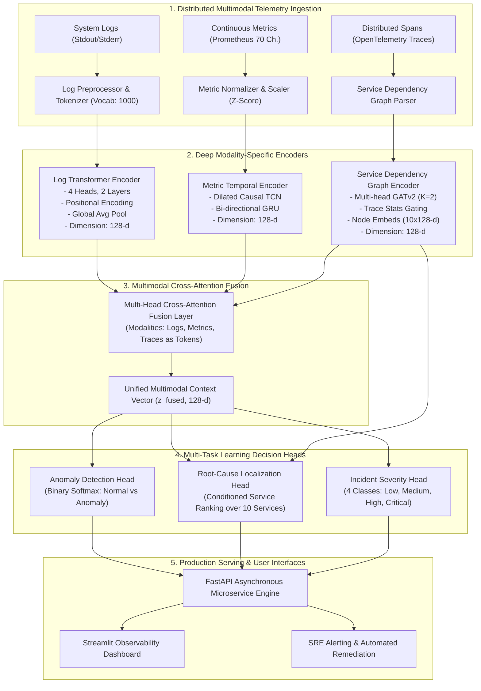

# ORCA End-to-End System Architecture

```mermaid
flowchart TD
    subgraph S1["1. Distributed Multimodal Telemetry Ingestion"]
        L["System Logs (Stdout/Stderr)"] --> LP["Log Preprocessor & Tokenizer (Vocab: 1000)"]
        M["Continuous Metrics (Prometheus 70 Ch.)"] --> MP["Metric Normalizer & Scaler (Z-Score)"]
        T["Distributed Spans (OpenTelemetry Traces)"] --> TP["Service Dependency Graph Parser"]
    end

    subgraph S2["2. Deep Modality-Specific Encoders"]
        LP --> LE["Log Transformer Encoder\n- 4 Heads, 2 Layers\n- Positional Encoding\n- Global Avg Pool\n- Dimension: 128-d"]
        MP --> ME["Metric Temporal Encoder\n- Dilated Causal TCN\n- Bi-directional GRU\n- Dimension: 128-d"]
        TP --> GE["Service Dependency Graph Encoder\n- Multi-head GATv2 (K=2)\n- Trace Stats Gating\n- Node Embeds (10x128-d)\n- Dimension: 128-d"]
    end

    subgraph S3["3. Multimodal Cross-Attention Fusion"]
        LE --> CAF["Multi-Head Cross-Attention Fusion Layer\n(Modalities: Logs, Metrics, Traces as Tokens)"]
        ME --> CAF
        GE --> CAF
        CAF --> FUSED["Unified Multimodal Context Vector (z_fused, 128-d)"]
    end

    subgraph S4["4. Multi-Task Learning Decision Heads"]
        FUSED --> H1["Anomaly Detection Head\n(Binary Softmax: Normal vs Anomaly)"]
        FUSED & GE --> H2["Root-Cause Localization Head\n(Conditioned Service Ranking over 10 Services)"]
        FUSED --> H3["Incident Severity Head\n(4 Classes: Low, Medium, High, Critical)"]
    end

    subgraph S5["5. Production Serving & User Interfaces"]
        H1 & H2 & H3 --> API["FastAPI Asynchronous Microservice Engine"]
        API --> UI["Streamlit Observability Dashboard"]
        API --> CLI["SRE Alerting & Automated Remediation"]
    end
```
